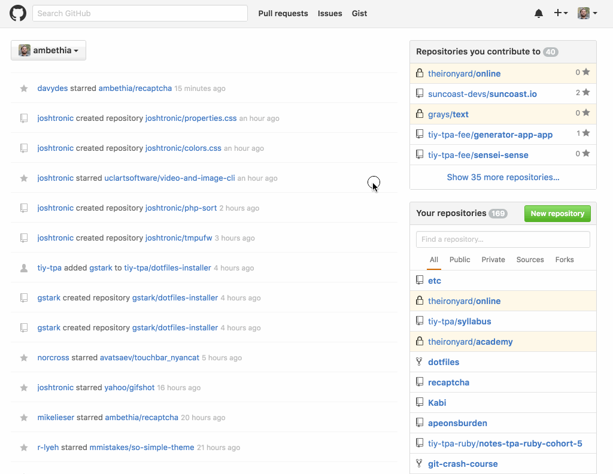
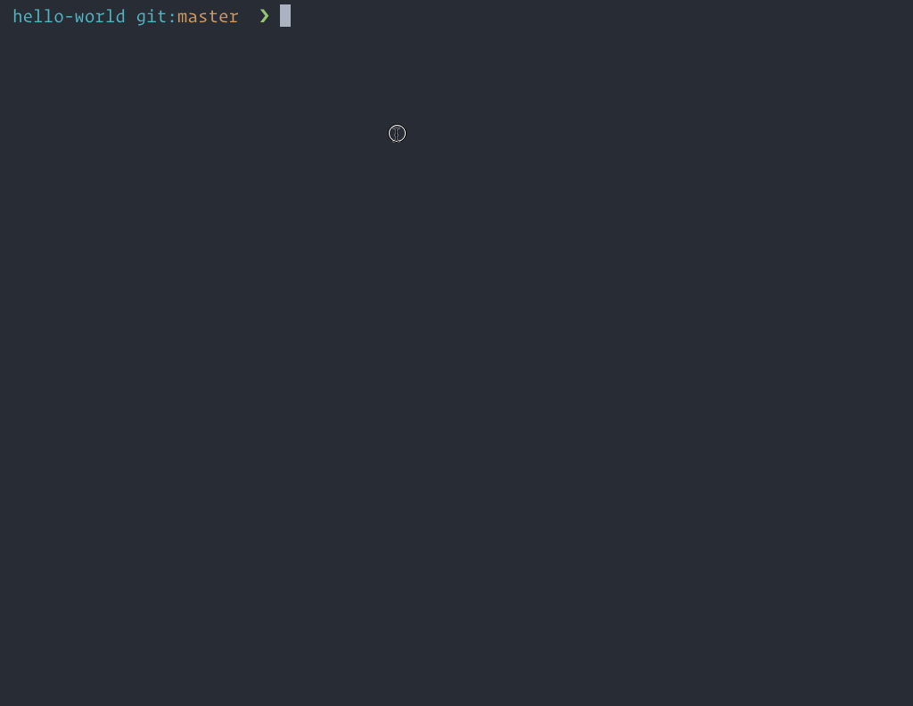

# Hello, World

In your first assignment you will end up with a web page, no matter how simple, published on the web.

## Objectives

- Get to know your text editor.
- Introduce yourself to working on the command line.
- Publish a web page.

## Requirements

- First, read [this short article](http://blog.froont.com/brief-history-of-web-design-for-designers/) on the history of web design.
- Compose a short essay (just a couple paragraphs at most) that summarizes your thoughts on the web; where's it's been, and where it's going.
- **Note**: You should complete at least the tasks given for _explorer_ mode as listed below before turning in the assignment, as well as before attempting _adventure_ or _epic_ modes.

### Setup

- First, ensure you have the [`app-app` generator](https://github.com/tiy-tpa-fee/generator-app-app) installed. We will have done this in class.

- Open your Terminal and create and change into the project's directory:

  ```sh
  mkdir -p ~/tiy/week-1/day-1/hello-world
  cd ~/tiy/week-1/day-1/hello-world
  ```

- Run the generator to create a boilerplate project:

  ```sh
  yo app-app alpha
  ```

  This might take a minute to run, the generator is installing a handy development server and a tool to easily deploy our page to the web.

- Let's create our `git` repository now, and start tracking changes right away:

  ```sh
  git init
  git commit -am "Hello, App App"
  ```

  You can change the commit message to be anything you want.

- Open Visual Studio, "File => open => Website"

- In your solution explorer, find, "public/index.html", bring up the context menu, and select "Set as Start Page"

- Open "public/index.html", and change "/screen.css" to  "screen.css"

- In the dialog that popped up, select "No, do not add a web.config" 

- It should open in new browser tab

- Using the file browser in your editor, open the file `public/index.html` and format your essay with HTML tags and place them into the document (remember all content goes _inside_ the `<body>` tags). Don't worry about the other files in the directory for now, we'll talk about those later, right now, we're mostly concerned with the two files in `public`; `index.html` and `screen.css`. 

- To see your changes, you need to refresh the browser

### Adventure Mode

- Research the `id` and `class` HTML attributes.
- Use valid CSS to style the page (in the neighborhood of 24 CSS statements).
- Use at least one image somewhere on the page (like the screen shot of your terminal if you do *Epic Mode*, or anything else you see fit).

### Epic Mode

- Create a full layout for your page (heading, navigation, sidebar, footer, etc.).
- Use more complex CSS selectors than we covered in class.

## Turning In

These steps will be followed for almost every assignment going forward. Once you've completed at least _explorer_ mode and you're satisfied with your work, let's get it published. First let's get it up on GitHub.

- In your browser, go to [GitHub](github.com) and create a new repository, I suggest using the title of the assignment (`hello-world`) for your repository name.

  

- Add the empty repository you created on GitHub as a _remote_ to your local repo:

  ```sh
  git remote add origin git@github.com:USERNAME/hello-world.git
  ```

  Conveniently, you can copy this line from GitHub after creating a new repo.

- Push our local commits to GitHub:

  ```sh
  git push -u origin master
  ```

  The `-u` option tells git we want to making pushing the `master` branch to `origin` the default, so next time, we can just type `git push`.

- Now that our source code is up on GitHub, let's publish our page to [Surge](https://surge.sh). The command to do this has already been setup for you:

  ```sh
  npm run deploy
  ```

  This first time you do this, you'll be prompted to create an account. By default, surge will assign you a random subdomain name, we'll talk about customizing this another time. For now, set the "website" field of your GitHub repo's info to be that URL:
    

- Turn in the URL to your repository on GitHub in newline. It should look like:

  > `https://github.com/USERNAME/hello-world`

## Additional Resources

- https://developer.mozilla.org/en-US/Learn/HTML/HTML_tags
- http://atozcss.com/start-here/
- http://www.evolutionoftheweb.com
